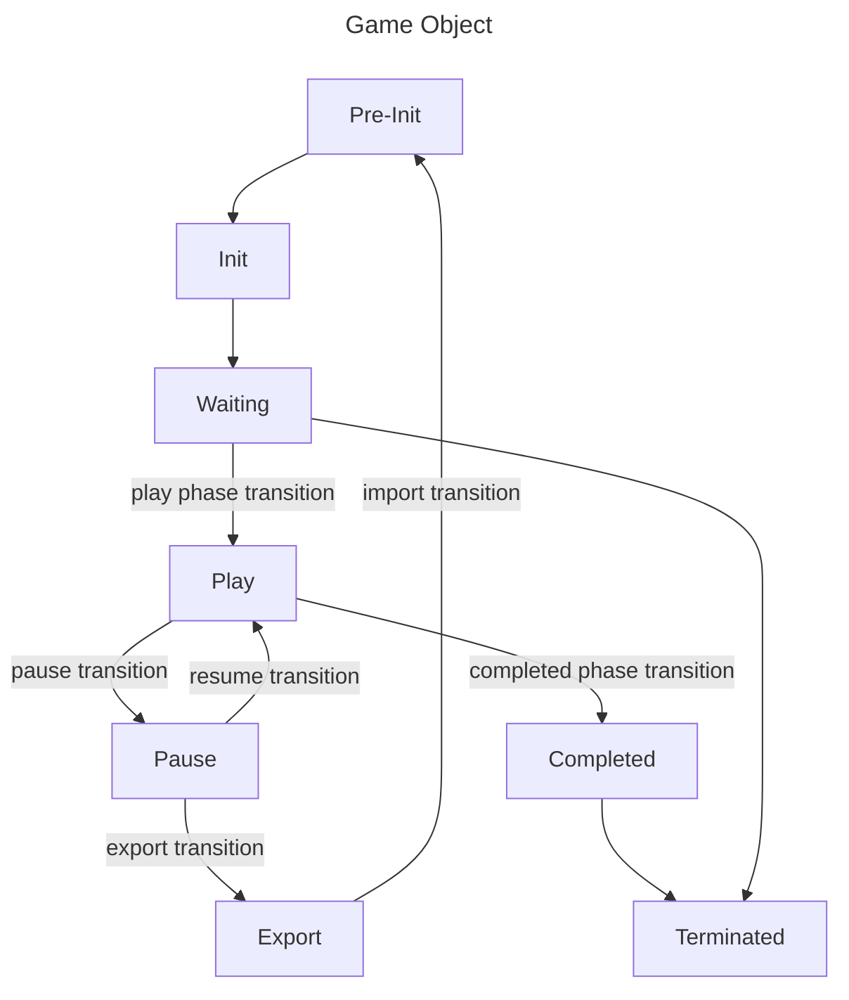

```mermaid
---
title: Game Object
---
graph TD;
    Pre-Init --> Init;
    Init --> Waiting;
    Waiting -- play phase transition --> Play;
    Play -- pause transition --> Pause;
    Pause -- resume transition --> Play;
    Play -- completed phase transition --> Completed;
    Completed --> Terminated;
    Pause -- export transition --> Export;
    Export -- import transition --> Pre-Init;
    Waiting --> Terminated;
```
